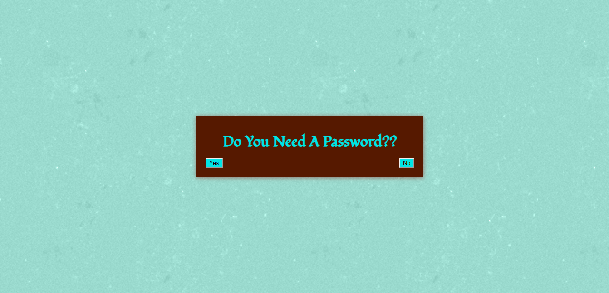
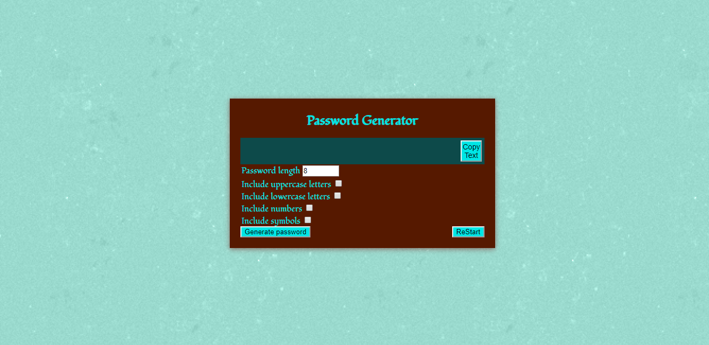

# KCPswdGen
Password Generator

**Description:**

In this world of cyber insecurity, passwords are crucial to an employee with access to sensitive data.  This application will generate a strong password that provides greater security and meets the following criteria:

1. Character Length: 8 - 128 
2. Lowercase Characters
3. Uppercase Characters
4. Special Characters
5. Numeric Characters

While the first is required, any combination of the rest will generate the requested password.

Usage:
For companies that handle large amounts of sensitive data, weak passwords can pose a real security threat.  An application that can generate strong passwords quickly and effortlessly saves employees time and ensures secure access to data.

### File List:

1. Index.html
    
    Main Page - Greeting with link to Password Generator

2. Index.js    
    
    Javascript for Main Page 

3. Pswd.html      

     Password Generator Page

4. Pswd.js 

     Javascript for Password Generator

5. Style.css         

    Stylesheet for all

6. Reset.css

    Compressed set of CSS rules that resets the styling of all HTML elements to a consistent baseline.

Link to site

https://karna1014.github.io/KCPswdGen/

